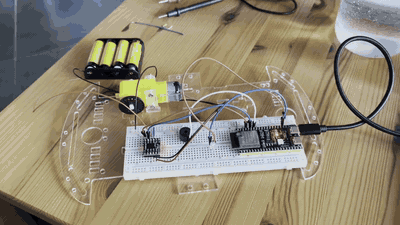

# ESP32

## Installation

Installing micropython on the ESP32:

- install `esptool` with `uv add esptool`
- Erase the flash with `make erase-flash`
- download the firmware from `https://micropython.org/download/ESP32_GENERIC_S3/`
- Install micropython with `make write-flash`
- Install `mpremote` with `uv add mpremote`

## Usage

- Connect the ESP32 to the computer
- Run `make repl` to enter the REPL
- Run `make run` to run the code
- Run `make cp` to copy the code to the ESP32
- Run `make ls` to list the files on the ESP32

> To run code on boot, use copy a `boot.py` file to the ESP32. `boot.py` is intended for early initialization: filesystem setup, Wi-Fi configuration, low-level hardware setup, etc. It should normally finish quickly. Then MicroPython automatically executes `main.py`.

## Experiments

- Bought some parts on Amazon
- Solder cables to the motors, solder pins to the DRV8833 motor driver
- Check with multimeter
- Setup breadboard with esp32, buzzer, led, DRV8833 motor driver
- buzzer sound and led toggles during boot, motor moves forward and backward

[Watch the demonstration with sound](docs/exp1.mp4) · [Original MOV](docs/exp1.MOV)

## Issues

- do not add an infite loop in `boot.py`, it runs before repl and will freeze the ESP32.
- use `uv run mpremote mount . run main.py` to avoid having to manually copy the code to the ESP32 everytime you make a change.
- seeing some inconsistencies with micropython (buzzer sounds while motor moves), trying to use C++instead. C++ solves the issue.
- solved the issue with micropython

> The likely cause was PWM channel reuse in MicroPython. The buzzer used a PWM channel first. deinit() stopped its tone, but MicroPython’s ESP32 code can reuse that channel for the motor while the buzzer pin still has the old PWM routing. That fits why it buzzed only when motor IN1 ran forward. MicroPython’s ESP32 PWM code shows the channel being released and later reused.
> The fix reconfigures GPIO41 as an ordinary low output after the tone, disconnecting that PWM routing. We also set it low again before the motor test.

## References

- [https://docs.espressif.com/projects/esptool/en/latest/esp32s3/](https://docs.espressif.com/projects/esptool/en/latest/esp32s3/)
- [https://micropython.org/download/ESP32_GENERIC_S3/](https://micropython.org/download/ESP32_GENERIC_S3/)

